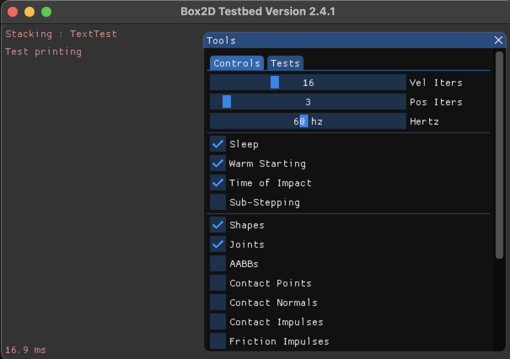
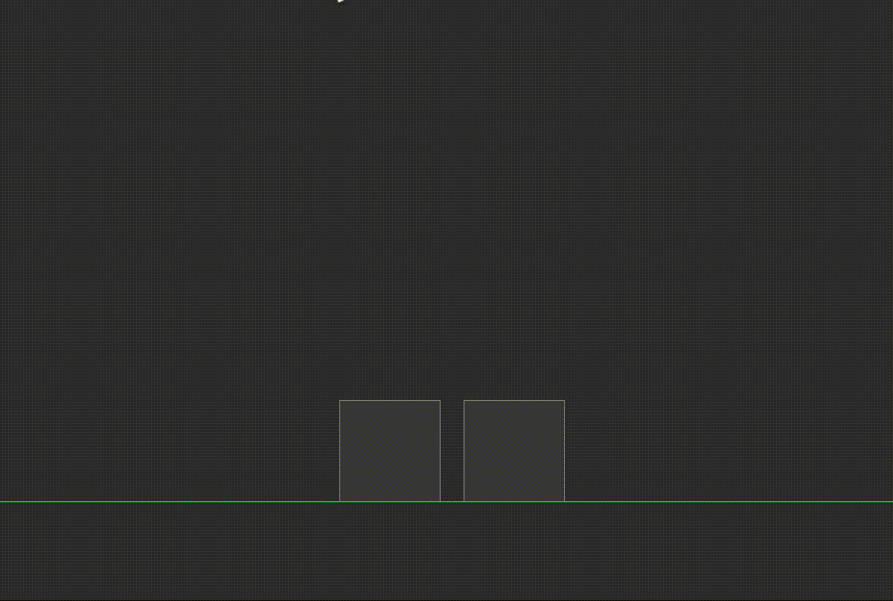
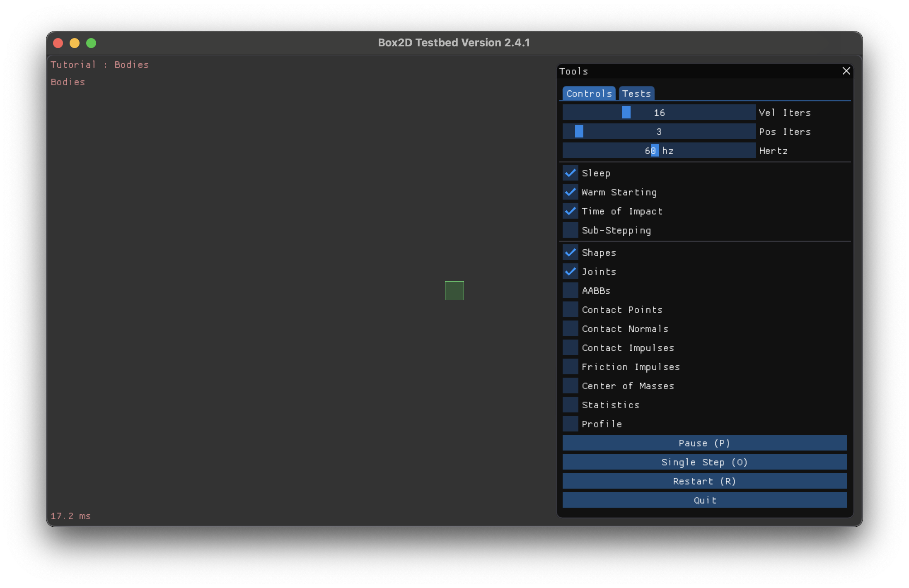
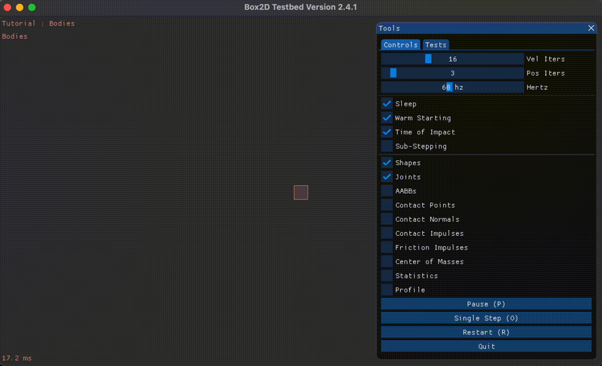
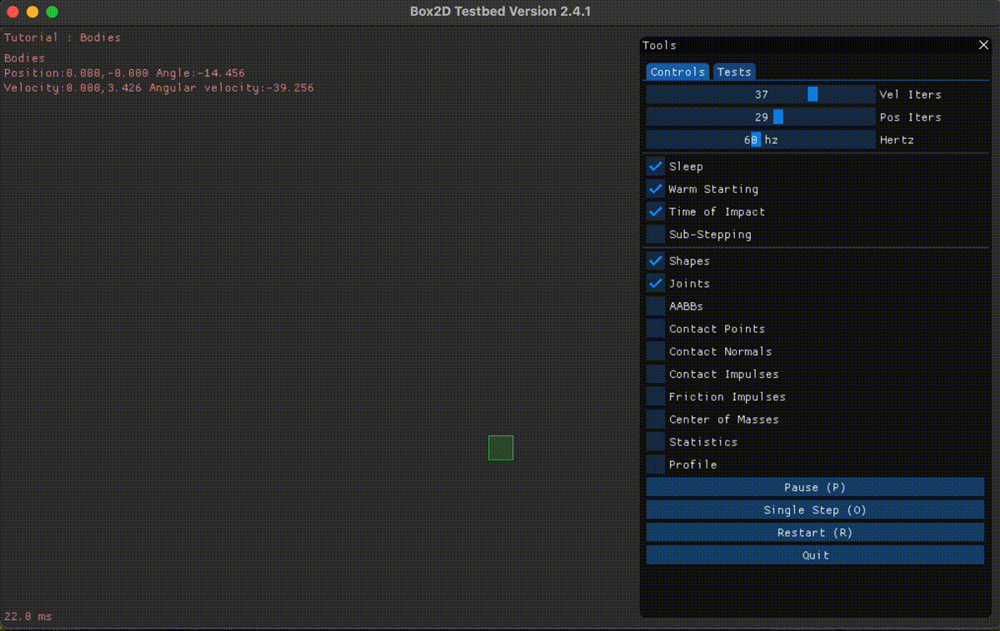
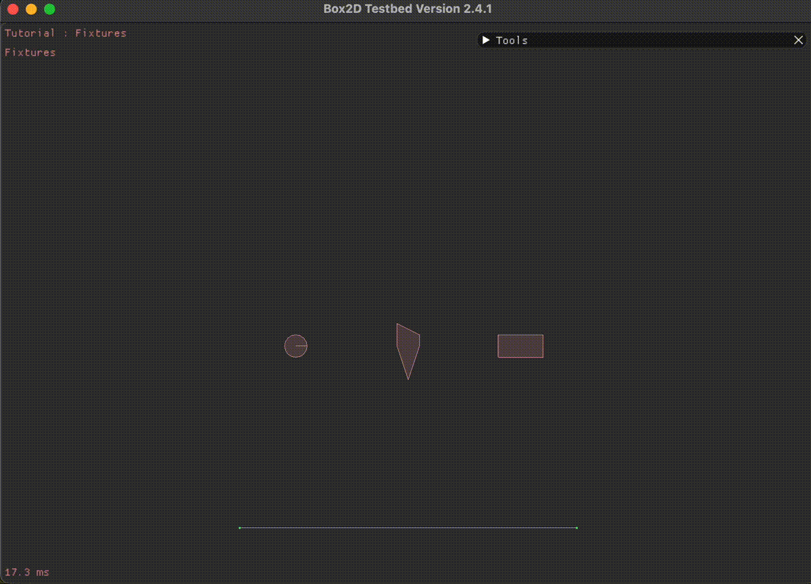
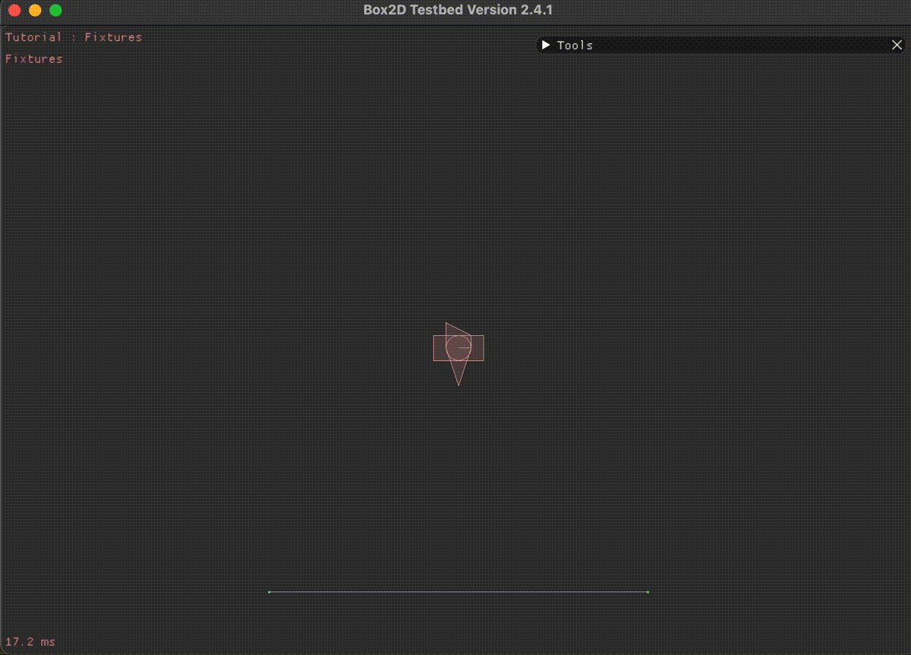
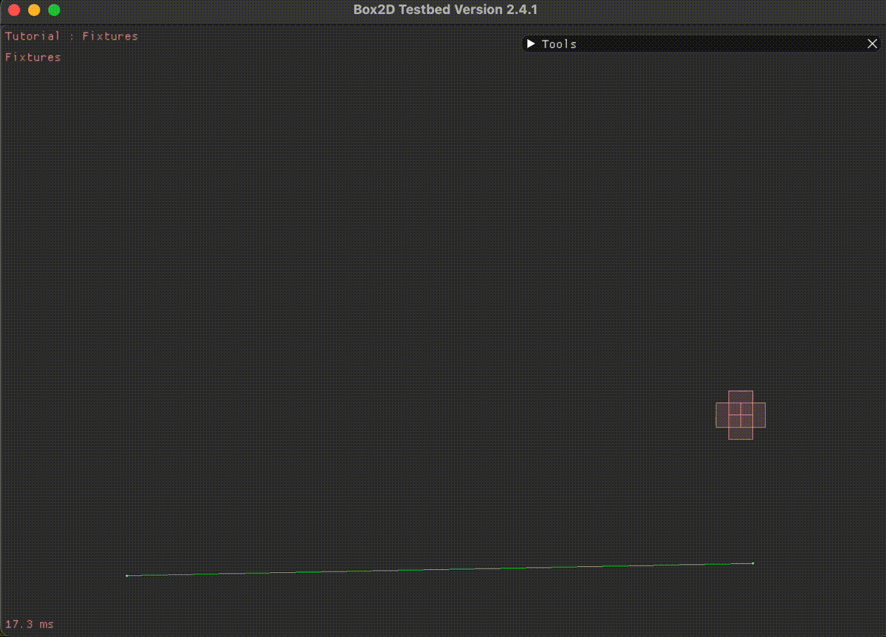

# Box2d
It operates on a Mac.
## Result(Mac)
### Print text on testbed

### Two box physics test

### Bodies
- Static Body(Color: Green)

- Dynamic Body(Color: Red)

- Kinematic Body(Color: Blue)

### Fixtures
- Shape and Density

- Attach all three of these fixtures onto one body

    If you change dynamicBody2 and dynamicBody3 to dynamicBody1, the three fixtures are merged into dynamicBody1.

    

- Friction and Restitution
    
    friction: 1.5
    
    restutution: 0.5

    

