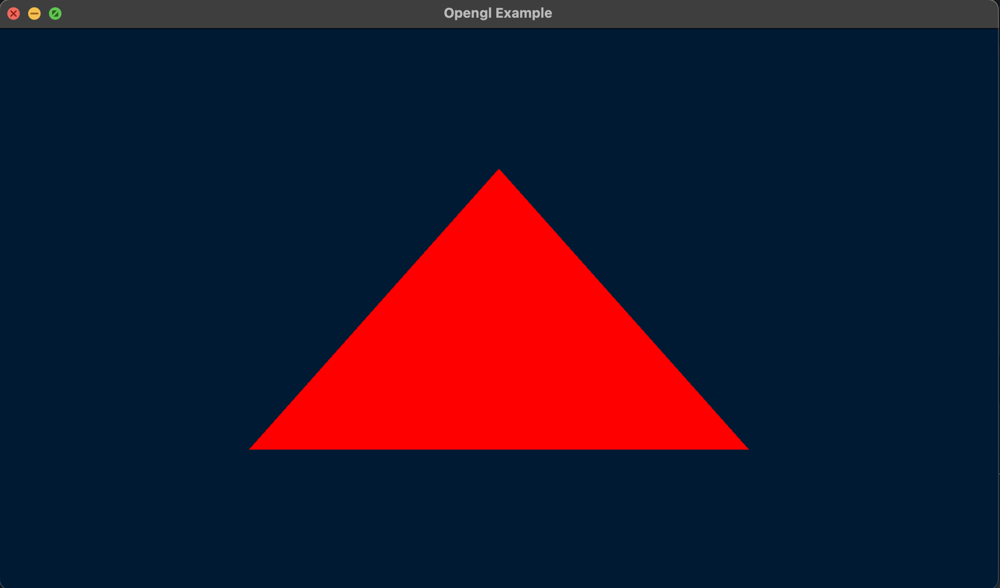
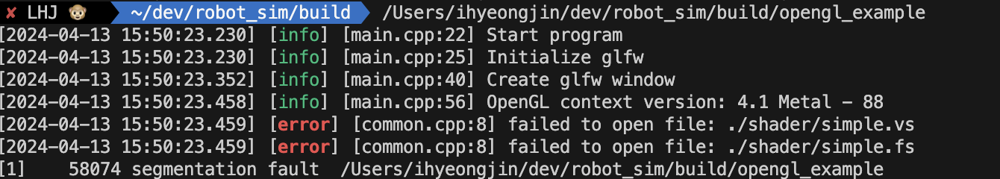

# Triangle
It operates on a Mac.
## Result(Mac)



## Error
If an error like the one below occurs, do two things.



1. Add code in setting.json
```
"cmake.debugConfig": {
        "cwd": "${workspaceFolder}"
    }
}
```
2. Enter the path to the executable file


